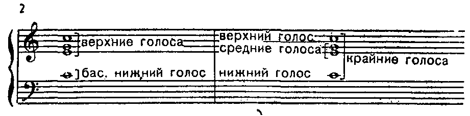
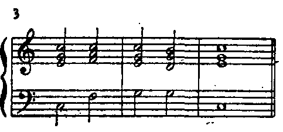
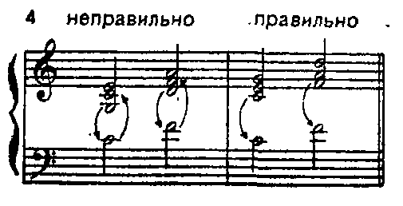
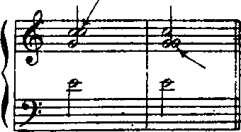
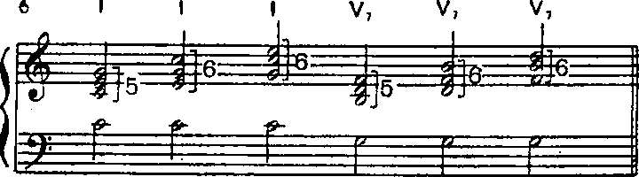
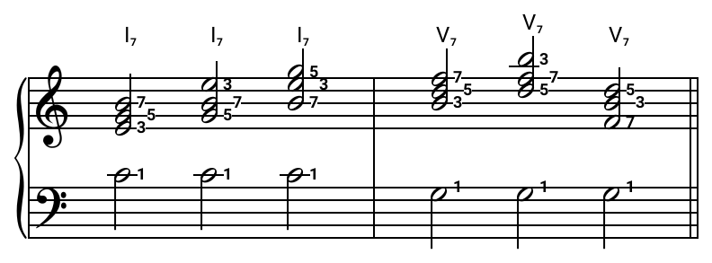
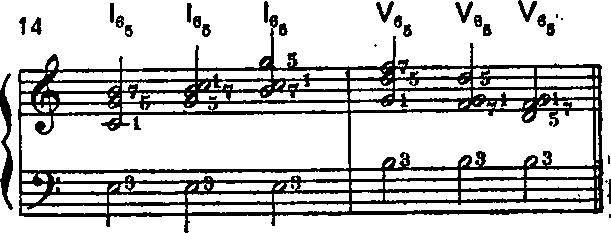
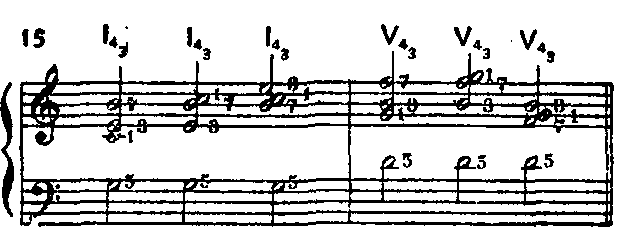

# 1. Введение. Голосоведение в мажоре

## I. О курсе гармонии

1. Слово гармония применяется в различных смыслах. Гармонией в простейшем значении называется закономерное объединение звуков в аккорды и их осмысленное последование.
2. Краткий курс гармонии посвящается изучению основных аккордовых последований, встречающихся в музыке
3. Теоретические основы гармонии объясняют закономерности образования, чередования и связи отдельных аккордов.
4. Практические задания призваны подкрепить теоретические положения и научить ученика сознательному отношению к гармонии.
5. Знание гармонии необходимо главным образом для двух целей: 
    а) аналитической — для лучшего понимания музыкальных произведений; 
    б) практической — для сочинения музыки или различных обработок ее (оркестровки, аранжировки). Из них первая цель стоит не только перед музыкантами-профессионалами (композиторами, музыковедами, исполнителями), но и перед развитыми любителями музыки.

## II. Четырехголосное сложение аккордов

1. Изучение гармонии строится на аккордах в четырехголосном сложении. Четырехголосным сложением называется образование аккорда из четырех звуков.
2. Каждый звук аккорда называется голосом. Все голоса нумеруются сверху вниз (первый, второй, третий, четвертый), а также имеют различные названия:
    - первый голос — мелодия, или сопрано, или верхний голос,
    - второй голос — альт,
    - третий голос — тенор,
    - четвертый голос — бас, или нижний голос
    
**Пример 1**

        
- первый, второй и третий голоса вместе — верхние голоса,
- первый и четвертый голоса вместе — крайние голоса,
- второй и третий голоса вместе — средние голоса

**Пример 2**

    
3. Аккорды в четырехголосном сложении пишутся на двух соединенных нотных строчках — верхней в скрипичном ключе и нижней — в басовом (как для фортепиано):
   
   три верхних голоса — на верхней строчке, для удобства чтения — с общим штилем (палочкой), направленным вверх,
   
   а нижний голос (бас) — на нижней строчке со штилем, направленным вниз.

**Пример 3**

4. Бас не может быть выше верхних голосов, но может совпадать, по высоте с третьим голосом.

**Пример 4**

5. Также и верхние голоса не могут «перекрещиваться», но каждая пара соседних голосов (то есть первый и второй, или второй и третий) может совпадать по высоте.
  
**Пример 5**

правильно
 

6. Верхние голоса пишутся на возможно близком расстоянии между собой, первоначально так, чтобы интервал между первым и третьим голосами был уже октавы.

**Пример 6**

7. Расположение аккорда, при котором между первым и третьим голосом образуется интервал уже октавы, называется **тесным**.
8. Расположение аккорда, при котором между первым и третьим голосами образуется интервал шире октавы, называется **широким**.

> картинка 7

9. В аккордах в широком расположении расстояние между соседними верхними голосами (первым и вторым, вторым и третьим) не может быть шире октавы.
    
> картинка 8

10. В любом расположении (тесном и широком, а также смешанном, см. стр. 20) интервал между третьим голосом и басом не ограничивается и теоретически может быть любым.

> картинка 9   

11. Данный курс гармонии строится, как правило, на аккордах в **тесном** расположении.

## III. Трезвучия в четырехголосном сложении

1. В трезвучиях (всех видов) в четырехголосном сложении один из составных звуков удваивается (пишется два раза). При этом:
    - в верхних голосах пишутся все три звука (основной, терцовый и квинтовый тоны),
    - в басу пишется один из них (основной, терцовый или квинтовый тон) в зависимости от вида аккорда, то есть
    - звук, помещенный в басу, удваивает (повторяет) один из звуков, помещенных в верхних голосах.
2. Таким образом:
    - в трезвучии основного вида удваивается основной тон (х 1)
    
    > картинка 10

   - в секстаккорде удваивается терцовый тон (х 3)
   
    > картинка 11

    - в квартсекстаккорде удваивается квинтовый тон (х5).
    
    > картинка 12
    
## IV. Септаккорды в четырехголосном сложении
  
1. В септаккордах (всех видов) в четырехголосном сложении
    - каждый звук пишется по одному разу (ни один из звуков не удваивается), то есть
    - звук, помещенный в басу, в верхних голосах не пишется (не повторяется).
2. В септаккорде основного вида (7)
    - в басу пишется основной тон,
    - в верхних голосах пишутся остальные три звука (то есть терцовый, квинтовый и септимовый тоны) в различных расположениях.
    
    **Пример 13**
    
    
3. В квинтсекстаккорде (6/5)
    - в басу пишется терцовый тон,
    - в верхних голосах пишутся остальные три звука (то есть основной, квинтовый и септимовый тоны) в различных расположениях.
    
4. В терцквартаккорде (4/3)
    - в басу пишется квинтовый тон,
    - в верхних голосах пишутся остальные три звука (то есть основной, терцовый и септимовый тоны) в различных расположениях.
    
5. В секундаккорде (2)
    - в басу пишется септимовый тон,
    - в верхних голосах пишутся остальные три звука, то есть основной, терцовый и квинтовый тоны (как в трезвучии). Ср. верхние голоса в примерах 16 и 10.

## V. Гармонические цифровки

1. Цифровое обозначение аккордового последования называется гармонической цифровкой или просто цифровкой.
2. Решение (расшифровка) цифровки заключается в правильной записи нотами обозначенного в ней аккордового последования.
3. Тактовый размер учебной цифровки всегда одинаков (2/2) и поэтому обычно не обозначается.
4. Каждый аккорд цифровки обозначается половинными нотами и длится полтакта, будучи помещен, таким образом, на сильной или слабой доле. Первый и последний аккорды помещаются на сильной доле такта. Последний аккорд длится целый такт (пишется целыми нотами).

**Пример 17**

--- 
Первый аккорд пишется в том мелодическом положении, которое указывается мелкой арабской цифрой обычно в кружке (наверху, справа от номера его ступени):
- цифра 1 указывает мелодическое положение основного тона,
- цифра 3 указывает мелодическое положение терцового тона, 
- цифра 5 указывает мелодическое положение квинтового тона.

**Пример 18**

**Пример 19**

## VI. Голосоведение

1. Решенные таким образом цифровки (то есть получившиеся аккордовые последования), представляют учебные образцы, нарочито ограниченные в мелодическом и ритмическом отношениях ради сосредоточения внимания на их гармонических свойствах.
2. Каждый образец (каждая решенная таким образом задача) должен представить определенное логичное последование аккордов.
3. Аккорды такого последования не просто сменяют друг друга, а переходят один в другой таким образом, чтобы каждый голос (первый, второй, третий, четвертый) образовал осмысленную мелодическую линию, а все последование образовало одновременное звучание четырех мелодических линий.
4. Для того, чтобы каждая из линий была логичной, образование ее подчиняется специальным правилам голосоведения.
5. **Голосоведением** называется процесс образования мелодических линий, то есть движение каждого отдельного голоса от аккорда к аккорду.
6. Принципы голосоведения могут быть различными. В книге рассматриваются правила, обеспечивающие голосоведение наиболее простое и естественное, плавное и «цепкое», присущее басу всевозможных гармонических последований и гармоническому остову средних голосов многоголосной музыки.
7. Исполнять решенные таким образом цифровки следует не только на фортепиано, но также и на инструментах с тянущимся звуком (фисгармонии, музыкальным ансамблем духовых или струнных) и хором, составленным из четырех партий (лучше всего - две партии сопрано, одна партия меццо-сопрано и одна партия мужских голосов).
8. При этом повторяющиеся в одной и той же партии звуки соседних аккордов нужно слиговывать (исполнять легато), как это обозначено на примере:

**Пример 20**

9. Ради упрощения записи лиги опускаются. При исполнении всех последующих примеров прием легато следует соблюдать обязательно.
10. Возникшие таким образом хоровые партии окажутся всего ближе к распевам некоторых монодических культур.

## VII. Основные правила голосоведения в мажоре

1. Бас движется по указанию цифровки преимущественно на ближайшее расстояние.

**Пример 21**

2. В верхних голосах
    - общие тоны остаются на месте (то есть повторяются в том же голосе)
    
    **Пример 22**
    
    - остальные голоса движутся на ближайшее расстояние (на секунду или на терцию)

    **Пример 23**

    - при возможности выбора (если общих тонов нет) — вниз, а не вверх.

    **Пример 24**

3. При соединении двух трезвучий (любых видов) с нормативным удвоением голосов (то есть с удвоением басового звука)
    - если бас идет на секунду вверх или вниз, верхние голоса не могут идти в том же направлении, что бас, а идут в противоположном направлении или остаются на месте
    
    **Пример 25**

    - при этом надо иметь в виду, что это правило сильнее второго. В случае противоречия между ними может оказаться, что общий тон не остается на месте.

    **Пример 26**

4. При соединении трезвучий основного вида II и V ступеней (II-V)
    - в верхних голосах общий тон предпочтительно не остается на месте, все верхние голоса идут вниз: два голоса — на терцию и один — на секунду;
    - общий тон может остаться на месте в том случае, если трезвучие II ступени взято в мелодическом положении квинты и в верхнем голосе образуется гаммообразное движение от этого звука в тонике (пример 276).

    **Пример 27**
    
## Задание 1

1. Переписать конспект* из урока 1 раздел VII
2. Решить в До мажоре цифровки 1-6:

<iframe width="100%" height="500" style="margin-bottom: 1rem; border-bottom: 1px solid #ddd" src="https://musescore.com/user/27326285/scores/6253228/embed" frameborder="0" allowfullscreen></iframe>
Вы можете скачать и распечатать задание по этой ссылке: <a href="https://musescore.com/user/27326285/scores/6253228/s/NKQXqt" target="_blank">Задание 1.2</a> 

*О конспекте см. стр. 155 (методические замечания, разд. IV).

