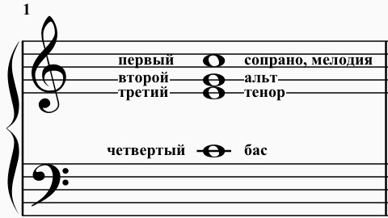
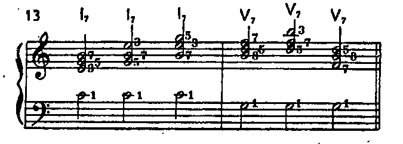

# 1. Введение. Голосоведение в мажоре

## О курсе гармонии

1. Слово гармония применяется в различных смыслах. Гармонией в простейшем значении называется закономерное объединение звуков в аккорды и их осмысленное последование.
2. Краткий курс гармонии посвящается изучению основных аккордовых последований, встречающихся в музыке
3. Теоретические основы гармонии объясняют закономерности образования, чередования и связи отдельных аккордов.
4. Практические задания призваны подкрепить теоретические положения и научить ученика сознательному отношению к гармонии.
5. Знание гармонии необходимо главным образом для двух целей: 
    а) аналитической — для лучшего понимания музыкальных произведений; 
    б) практической — для сочинения музыки или различных обработок ее (оркестровки, аранжировки). Из них первая цель стоит не только перед музыкантами-профессионалами (композиторами, музыковедами, исполнителями), но и перед развитыми любителями музыки.

## Четырехголосное сложение аккордов

1. Изучение гармонии строится на аккордах в четырехголосном сложении. Четырехголосным сложением называется образование аккорда из четырех звуков.
2. Каждый звук аккорда называется голосом. Все голоса нумеруются сверху вниз (первый, второй, третий, четвертый), а также имеют различные названия:
    - первый голос — мелодия, или сопрано, или верхний голос,
    - второй голос — альт,
    - третий голос — тенор,
    - четвертый голос — бас, или нижний голос
    
    
        
- первый, второй и третий голоса вместе — верхние голоса,
- первый и четвертый голоса вместе — крайние голоса,
- второй и третий голоса вместе — средние голоса

> картинка 2
    
3. Аккорды в четырехголосном сложении пишутся на двух соединенных нотных строчках — верхней в скрипичном ключе и нижней — в басовом (как для фортепиано):
   
   три верхних голоса — на верхней строчке, для удобства чтения — с общим штилем (палочкой), направленным вверх,
   
   а нижний голос (бас) — на нижней строчке со штилем, направленным вниз.

> картинка 3

4. Бас не может быть выше верхних голосов, но может совпадать, по высоте с третьим голосом.

> картинка 4

5. Также и верхние голоса не могут «перекрещиваться», но каждая пара соседних голосов (то есть первый и второй, или второй и третий) может совпадать по высоте.
  
> картинка 5  

6. Верхние голоса пишутся на возможно близком расстоянии между собой, первоначально так, чтобы интервал между первым и третьим голосами был уже октавы.

> картинка 6

7. Расположение аккорда, при котором между первым и третьим голосом образуется интервал уже октавы, называется **тесным**.
8. Расположение аккорда, при котором между первым и третьим голосами образуется интервал шире октавы, называется **широким**.

> картинка 7

9. В аккордах в широком расположении расстояние между соседними верхними голосами (первым и вторым, вторым и третьим) не может быть шире октавы.
    
> картинка 8

10. В любом расположении (тесном и широком, а также смешанном, см. стр. 20) интервал между третьим голосом и басом не ограничивается и теоретически может быть любым.

> картинка 9   

11. Данный курс гармонии строится, как правило, на аккордах в **тесном** расположении.

## Трезвучия в четырехголосном сложении

1. В трезвучиях (всех видов) в четырехголосном сложении один из составных звуков удваивается (пишется два раза). При этом:
    - в верхних голосах пишутся все три звука (основной, терцовый и квинтовый тоны),
    - в басу пишется один из них (основной, терцовый или квинтовый тон) в зависимости от вида аккорда, то есть
    - звук, помещенный в басу, удваивает (повторяет) один из звуков, помещенных в верхних голосах.
2. Таким образом:
    - в трезвучии основного вида удваивается основной тон (х 1)
    
    > картинка 10

   - в секстаккорде удваивается терцовый тон (х 3)
   
    > картинка 11

    - в квартсекстаккорде удваивается квинтовый тон (х5).
    
    > картинка 12
    
## Септаккорды в четырехголосном сложении
  
1. В септаккордах (всех видов) в четырехголосном сложении
    - каждый звук пишется по одному разу (ни один из звуков не удваивается), то есть
    - звук, помещенный в басу, в верхних голосах не пишется (не повторяется).
2. В септаккорде основного вида (7)
    - в басу пишется основной тон,
    - в верхних голосах пишутся остальные три звука (то есть терцовый, квинтовый и септимовый тоны) в различных расположениях.s
    
3. В квинтсекстаккорде (6/5)
    - в басу пишется терцовый тон,
    - в верхних голосах пишутся остальные три звука (то есть основной, квинтовый и септимовый тоны) в различных расположениях.
    > картинка 14

